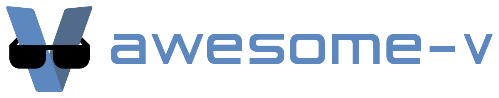

# Awesome V 

> A curated list of awesome V frameworks, libraries, software and resources.

[V](https://vlang.io/) is a simple, fast, safe, compiled language for developing maintainable software.

## Contents

- [Applications](#applications)
  - [Interpreters/Compilers](#interpreterscompilers)
  - [Package managers](#package-managers)
  - [Editors](#editors)
  - [Web](#web)
  - [Graphics](#graphics)
  - [Games](#games)
  - [Command-line](#command-line)
  - [Project Management](#project-management)
- [Libraries](#libraries)
  - [Syntax highlighting](#syntax-highlighting)
  - [Command Line Interface](#command-line-interface)
  - [Text processing](#text-processing)
  - [Graphics](#graphics-1)
  - [Web](#web-1)
  - [Database clients](#database-clients)
  - [Audio](#audio)
  - [Operating System](#operating-system)
  - [Automation](#automation)
  - [Telegram](#telegram)
  - [Files](#files)
  - [Game Development](#game-development)
  - [Eventing](#eventing)
  - [User Interface Toolkits](#user-interface-toolkits)
  - [Scientific Computing](#scientific-computing)
- [Other](#other)
  - [Videos](#videos)
  - [Programming Contests](#programming-contests)
  - [Tutorials](#tutorials)
  - [Online IDEs with V](#online-ides-with-v)
  - [Articles](#articles)
  - [Communities](#communities)
  - [Forums](#forums)

## Applications

### Interpreters/Compilers

- [v](https://github.com/vlang/v) - V itself. Simple, fast, safe, compiled language for developing maintainable software.
- [vbf](https://github.com/vpervenditti/vbf) - A brainfuck interpreter/compiler.
- [monkey_v](https://github.com/Delta456/monkey_v) - Implementation of [Thorsten Ball's Monkey Language](https://interpreterbook.com/) in V.
- [vcc](https://github.com/lemoncmd/vcc) - A C compiler written in V.
- [Vork](https://github.com/Itay2805/Vork) - Alternative V compiler/interpreter written in Python.

### Package managers

- [vpkg](https://github.com/vpkg-project/vpkg) - An alternative package manager for V.
- [vpm](https://github.com/yue-best-practices/vpm) - The V language package management tool written in V.

### Editors

- [vid](https://github.com/vlang/vid) - 1 MB text editor written in V with hardware accelerated text rendering. Compiles in <1s.

### Web

- [vorum](https://github.com/vlang/vorum) - Open-source blogging/forum software written in V.
- [Heroku Buildpack for V](https://github.com/louis77/heroku-buildpack-v) - Deploy V apps on Heroku.

### Graphics

- [raytracer](https://github.com/ali-raheem/vraytracer)

### Games

- [Vlang the Game](https://github.com/alula/vlang-the-game) - A little platformer written in V with [vSDL2](https://github.com/nsauzede/vsdl2), made purely for memes and fun.
- [Boundstone](https://github.com/organization/boundstone) - High Performance / Fast Compilation / Lightweight Minecraft: Bedrock Edition Server.

### Command-line

- [HN-top](https://github.com/BafS/hn-top) - A simple command to list most recent news from hacker-news.
- [vast](https://github.com/lydiandy/vast) - A simple tool for vlang, generate v source file to AST json file.
### Project Management

- [vset](https://github.com/mulh8377/vset) - A project setup and configuration tool for V projects.

## Libraries

### Syntax highlighting

- [v-vim](https://github.com/ollykel/v-vim) - Support for V syntax highlighting in Vim.
- [vim-v](https://github.com/cheap-glitch/vim-v) - Quality syntax highlighting for the V programming language.
- [vscode-vlang](https://github.com/0x9ef/vscode-vlang) - V Language extension for Visual Studio Code.
- [kate-syntax-highlight-v](https://github.com/Larpon/kate-syntax-highlight-v) - V syntax highlighting for [Kate](https://kate-editor.org/).
- [scite-v-support](https://github.com/sunnylcw/scite-v-support) - V syntax highlighting for [SciTE](https://www.scintilla.org/SciTE.html).
- [language-v](https://github.com/Cutlery-Drawer/language-v) - V language support for Atom (port of vscode-vlang).

### Command Line Interface

- [vargs](https://github.com/nedpals/vargs) - V library for parsing arguments from argv-like arrays.
- [progressbar](https://github.com/Waqar144/progressbar) - An easy to use V library for creating progress bars in cli.
- [boxx](https://github.com/thecodrr/boxx) - Create highly customizable terminal boxes that also look great! 📦
- [lol](https://github.com/0xLeif/lol) - V version of lolcat (text/character rainbowizer).

### Text processing

- [v-regex](https://github.com/spytheman/v-regex) - A simple regex library for V.
- [chalk](https://github.com/etienne-napoleone/chalk) - Colorize strings in the terminal.
- [crayon](https://github.com/thecodrr/crayon) - Paint your terminal output like Picasso. 🖍️🎨
- [cjson](https://github.com/lydiandy/cjson) - Wrap cJSON for vlang.

### Graphics

- [vgl](https://github.com/justicesuh/vgl) - Low-level graphics API access.
- [vsdl2](https://github.com/nsauzede/vsdl2) - A libSDL2 wrapper.

### Web

- [valval](https://github.com/taojy123/valval) - Web framework written in V, improved by vweb.
- [vex](https://github.com/nedpals/vex) - Web framework written on V inspired by Express and Sinatra.
- [vweb](https://github.com/vlang/v/tree/master/vlib/vweb) - V's built-in web framework. Used by Vorum.
- [v-jsonrpc](https://github.com/nedpals/v-jsonrpc) - Basic JSON-RPC 2.0-compliant server written on V.

### Database clients

- [redis](https://github.com/patrickpissurno/vredis) - Redis client for V, written in V.

### Audio

- [vave](https://github.com/thecodrr/vave) - A crazy simple library for reading/writing WAV files in V. 🌊
- [vspeech](https://github.com/thecodrr/vspeech) - Complete V bindings for Mozilla's DeepSpeech TensorFlow based Speech-to-Text library. 📢📜
- [v-miniaudio](https://github.com/Larpon/v-miniaudio) - Bindings for the excellent miniaudio C audio library.

### Operating System

- [clipboard](https://github.com/vlang/v/tree/master/vlib/clipboard) - V module for interacting with the OS clipboard. Fully cross-platform.

### Automation

- [vrobot](https://github.com/eioo/vrobot) - Desktop automation for V. Only supports Windows.

### Telegram

- [vgram](https://github.com/vpervenditti/vgram) - Telegram bot library.

### Files

- [v-mime](https://github.com/nedpals/v-mime) - MIME detection library for V.

### Game Development

- [vraylib](https://github.com/MajorHard/vraylib) - V wrapper (bindings) for [raylib](https://www.raylib.com), the C game development framework.

### Eventing

- [eventbus](https://github.com/vlang/v/tree/master/vlib/eventbus) - A simple event bus system for V.

### User Interface Toolkits

- [V UI](https://github.com/vlang/ui) - Integrated cross platform UI toolkit for Windows, macOS, Linux, Android, iOS and the web.
- [vgtk3](https://github.com/vgtk/vgtk3) - A wrapper for GTK3 in V.
- [vig](https://github.com/nsauzede/vig) - Bindings for [Dear ImGui](https://github.com/ocornut/imgui) GUI toolkit.
- [vnk](https://github.com/nsauzede/vnk) - Bindings for [Nuklear](https://github.com/vurtun/nuklear) GUI toolkit.

### Scientific Computing

- [vsl](https://github.com/vlang/vsl) - A pure-V scientific library with a great variety of functions.
- [vnum](https://github.com/vlang-num/vnum) - Numerical computing library supporting n-dimensional data, backed by LAPACK and BLAS.

## Other

- [lsp.v](https://github.com/nedpals/lsp.v) - Implementation of the Language Server Protocol spec on V.
- [setup-v-action](https://github.com/marketplace/actions/setup-v-environment) - GitHub action automation to use V in your workflow.
### Videos

- [V Programming Language](https://www.youtube.com/watch?v=BVCuZ7z7GMY&list=PLEPMhdsq-gNpFr40A-ZnX-Hu9l-Sp5Oc_)

### Programming Contests

- [Rosetta Code V](https://github.com/RustemB/rosetta-code-v) - Solutions for Rosetta Code in V.

- [Advent of Code 2019](https://github.com/mvlootman/aoc2019) - Solution of Advent of Code 2019 in V.

### Tutorials

- [Learn V in Y Minutes](https://github.com/v-community/learn_v_in_y_minutes)
- [V by Example](https://github.com/v-community/v_by_example) - V book as [GitBook](https://v-community.gitbook.io/v-by-example/).
- [V learning notes](https://github.com/lydiandy/vlang_note) - Personal learning notes in Chinese.

### Online IDEs with V

- [V Playground](https://vlang.io/play)
- [Judge0 IDE](https://ide.judge0.com/?XN9q)
- [DevBits V Playground](https://devbits.app/play?lang=v&code64=Zm4gbWFpbigpIHsKCWFyZWFzIDo9IFsnZ2FtZScsICd3ZWInLCAndG9vbHMnLCAnc2NpZW5jZScsICdzeXN0ZW1zJywgJ2VtYmVkZGVkJywgJ2RyaXZlcnMnLCAnR1VJJywgJ21vYmlsZSddIAoJZm9yIGFyZWEgaW4gYXJlYXMgewoJCXByaW50bG4oJ0hlbGxvLCAkYXJlYSBkZXZlbG9wZXJzIScpCgl9Cn0K)

### Articles

- [An introduction to V](https://simonknott.de/articles/VLang.html)
- [The Book of V](https://github.com/KeyWeeUsr/the-book-of-v/)

### Communities

- [V Community](https://github.com/v-community)

### Forums

- [r/vlang](https://www.reddit.com/r/vlang)
- [Stack Overflow](https://stackoverflow.com/questions/tagged/vlang)
